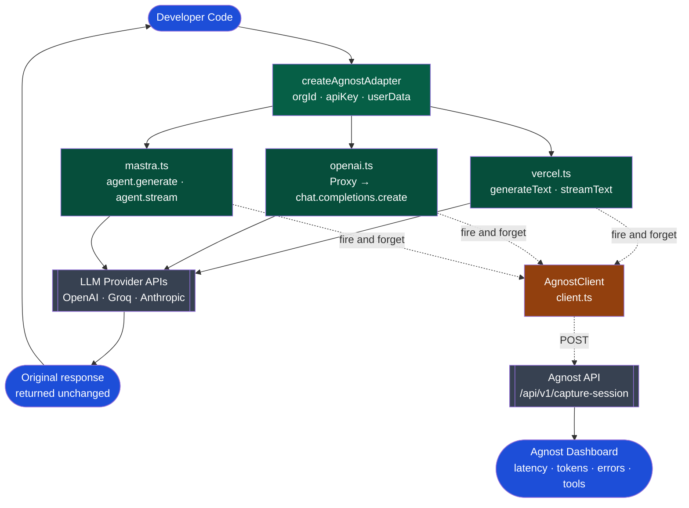

# REASONING.md — agnost-ai-adapter

## Why Track B

Track A (sentiment analytics) is a data pipeline problem. Track B is a 
developer experience problem. I chose Track B because the core challenge — 
getting observability into AI agents with minimal friction — is exactly the 
kind of problem that compounds in value as the ecosystem grows. Every new 
agent framework that ships creates a new integration surface. Building the 
right abstraction now means the solution scales without rewriting.

I also chose it because I could build something genuinely useful in a weekend. 
A half-finished sentiment engine has no value. A working wrapper that actually 
sends telemetry does.


## The Core Philosophy: Zero Friction

The single design constraint I held throughout: **a developer should be able 
to add observability in under 10 minutes without changing how their agent 
behaves.**

This ruled out a lot of approaches early:
- No new SDK to learn
- No changes to existing response handling
- No required `await` on the telemetry path
- No crash if Agnost's API is slow or down

Every technical decision below flows from this constraint.

---

## Architecture
## Architecture



The adapter sits between the developer's code and the SDK. It intercepts 
the call, records timing and metadata, returns the original response 
untouched, and sends telemetry in the background. The developer never 
sees the telemetry layer.

---

## SDK Integration: Decisions Within the Brief

The SDK targets — Vercel AI, OpenAI SDK, and Mastra — were defined in the assignment. The decisions were around prioritization, integration strategy, and scope.

**Vercel AI SDK was built first** because it has strong adoption in the TypeScript ecosystem and exposes clean `generateText` / `streamText` APIs, making it the simplest starting point.

**OpenAI SDK required a different approach.** Since it is a stateful client with multiple namespaces, a Proxy pattern was used to preserve the full SDK surface while intercepting only `chat.completions.create()`.

**Mastra required a different philosophy.** Since it operates on Agent objects and its types change across versions, structural typing (`agent: any`) was used to keep the wrapper version-agnostic.

**Out of scope:** LangChain was excluded to keep the MVP lightweight and focused on minimal-friction integrations. Native Anthropic support was also skipped since it is already covered through `@ai-sdk/anthropic` within the Vercel AI SDK ecosystem.

---

## Three Technical Decisions That Mattered

### 1. The "Bring Your Own Client" Pattern (OpenAI)

For the Vercel adapter, I create the wrapper internally — the developer 
just passes params as usual. For OpenAI, I accept the developer's 
pre-configured client and wrap it.

Why the difference? The OpenAI SDK has 15+ configuration options: custom 
base URLs, organization IDs, timeouts, fetch implementations, retry 
settings. If I recreated the client internally, I'd need to expose all 
of these. By accepting their existing client, I expose zero configuration 
overhead. They keep full control.

### 2. Three-Layer Proxy for OpenAI (Not a Plain Object)

My first instinct was to return a plain object shaped like 
`{ chat: { completions: { create: ... } } }`. This would have worked for 
the happy path — but it would have silently broken `images.generate()`, 
`models.list()`, `audio.transcriptions.create()`, and every other SDK 
method the developer was already using.

The fix was three nested JavaScript Proxies:
- Proxy 1 watches the top-level client — intercepts `chat`, passes 
  everything else through via `Reflect.get`
- Proxy 2 watches `chat` — intercepts `completions`, passes everything 
  else through
- Proxy 3 watches `completions` — intercepts `create`, passes 
  `stream` and other methods through

The developer gets back a drop-in replacement for their OpenAI client. 
Every method works. Only `chat.completions.create()` has telemetry 
added around it.

### 3. Fire-and-Forget Telemetry

`sendTelemetry()` is synchronous from the caller's perspective. The 
`fetch` call inside is intentionally not awaited:

```typescript
fetch('https://api.agnost.ai/api/v1/capture-session', { ... })
  .catch(() => {}); // intentional - never throw on telemetry failure
```

This means:
- No meaningful latency added to the user-facing request pat
- No crash if Agnost's API is slow, down, or returns an error
- The developer's users never feel the observability layer

Observability should provide visibility without noticeably affecting the developer or end-user experience.

---

## Edge Cases Handled

**Streaming vs standard responses (OpenAI):** When `params.stream === true`, 
the response is a raw stream — `.choices` and `.usage` don't exist yet. 
Added an explicit check: streaming calls get immediate telemetry with 
`streamed: true`; standard calls get full token usage and finish reason.

**Streaming telemetry (Vercel AI):** `streamText` returns immediately 
without a resolved response. Used `result.usage.then()` to attach a 
listener — when the stream completes and token counts are available, 
telemetry fires then. The stream itself is returned instantly.

**Session IDs:** Used `randomUUID()` from `node:crypto` as a fallback so every call 
gets a unique session ID even if the developer doesn't provide one. 
This keeps the library compatible with Node.js 18+ without relying on 
the global Web Crypto API (Node 19+)

**Unsupported frameworks (escape hatch):** Exposed `adapter.client` 
directly so developers using Anthropic, Google Gemini, or any other 
framework not natively wrapped can call `adapter.client.sendTelemetry()` 
manually. No one is locked out of the ecosystem.

**Error capture:** Wrapped all SDK calls in `try/catch`. If the LLM 
provider fails (rate limits, downtime, network errors), the adapter 
captures the failure duration and error message, sends telemetry with 
`failed: true`, then re-throws the original error. The developer's 
error handling is never interfered with.

---

## What I Deliberately Left Out

**Mastra type imports:** Mastra's TypeScript types change significantly 
between minor versions. Using `any` with structural typing means the 
wrapper works across `@mastra/core` versions without breaking on 
type mismatches.

**Retry logic on telemetry:** Adding retry logic would mean buffering 
failed requests, which adds complexity and memory overhead. For 
observability, losing a small percentage of events is acceptable. 
Retrying failed telemetry is a production concern, not an MVP concern.

**`capture-event` and MCP integration:** The `/capture-session` endpoint 
covers the most valuable data: latency, token cost, tool usage, and 
errors per agent turn. That's 90% of what developers need to debug and 
monitor agents. Granular step-by-step event tracing and MCP interception 
are the right next steps - but they would take more than a week

**Production concerns intentionally deferred:** I did not implement telemetry batching, PII redaction, sampling, or payload size limits in this MVP. These become important at scale because observability systems can easily create large volumes of data and privacy concerns. For a weekend implementation, I prioritized proving the adapter pattern and keeping the integration friction low.

---

## Demo Environment Strategy

The demo server runs against real LLM provider APIs by default. 
Both the Vercel AI SDK route and OpenAI SDK route make live calls 
to OpenAI — a valid `OPENAI_API_KEY` in `.env` is required to run 
the full flow.

Mock provider routes are included as commented code in `server.ts` 
for environments without API access. To switch:

- Comment out the active route
- Uncomment the mock route directly below it
- Run `npm run dev` — no API key required

The Mastra route uses a mock agent by default since `@mastra/core` 
requires its own setup. The adapter wrapper code is identical 
regardless of whether a real or mock provider is used — the 
interception, timing, and telemetry dispatch happen at the 
wrapper layer, not the provider layer.

## With One Month Instead of One Weekend

**Week 1:** Publish to npm as `agnost-ai-adapter`. Add proper TypeScript 
generics on return types. Add `@ai-sdk/anthropic` and `@ai-sdk/google` 
adapters — they follow the same Vercel AI pattern and would take 
a day each.

**Week 2:** Implement `/capture-event` support. This enables step-level 
tracing inside a single agent turn — when a sub-agent is spawned, when 
a tool is called, when a retrieval happens. This data is what separates 
session-level monitoring from real observability.

**Week 3:** MCP (Model Context Protocol) client interception. As MCP
is slowly becoming the standard for tool distribution, wrapping the 
MCP client means Agnost automatically monitors standard tool invocations 
across any MCP-compliant server — without needing SDK-specific wrappers for 
each new framework.

**Week 4:** A retry queue for failed telemetry. An in-memory buffer that 
retries failed `capture-session` calls with exponential backoff — 
so observability data survives brief Agnost API outages without affecting 
the agent's response path.

---

## Vision: Why This Matters

For many developers, AI agents can feel like black boxes once deployed.
A developer deploys an agent, users complain it's slow or wrong, 
and the developer has no idea which call failed, which tool was invoked, 
how many tokens the response burned, or what the user actually asked. 
They're flying blind.

The agent ecosystem is also fracturing. Vercel AI, OpenAI SDK, Mastra, 
LangChain, Anthropic, AutoGen — every team picks a different framework, 
and every framework requires a different monitoring setup.
The agent observability ecosystem is still evolving, 
and developers often need to combine multiple tools to understand agent behavior.

I think Agnost has an opportunity to become that layer. Not by building yet another agent 
framework, but by sitting underneath all of them — capturing telemetry 
regardless of which SDK a team chose. The `/capture-session` endpoint is 
the foundation. The adapter pattern in this repo is the on-ramp. The 
long-term play is a dashboard where any developer, on any framework, 
can see exactly what their agents are doing, what they're costing, and 
where they're failing — in one place.

That's a real product gap. This is the starting point for closing it.